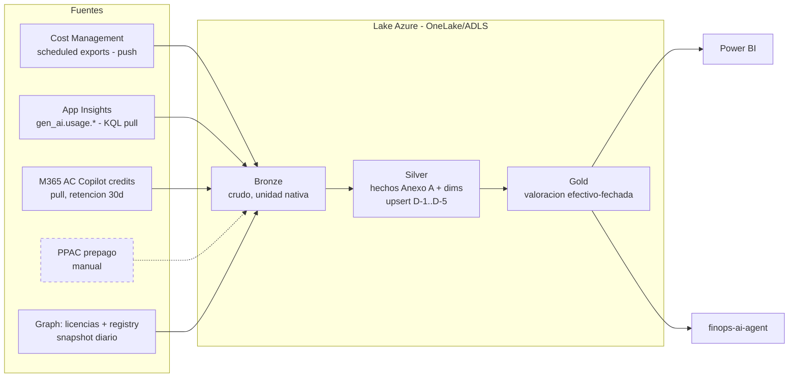

> **Snapshot baseline 2026-06-11** — fuente canónica: vault Obsidian `KnowledgeBase/architecture-decisions/`.

# ADR-K23 — Modelo de tres planos de gobierno de agentes + capa FinOps de consolidación custom

## Status

**PROPOSED** (2026-06-11). Pendiente revisión Gustavo antes de ACCEPTED. Origen: sesión claude.ai investigando "¿dónde veo observabilidad + costes + metadata anti-duplicación unificados entre Agent 365, Copilot Studio y Foundry, o lo construyo?"

**Scope review (2026-06-11 pm):** ejes 1, 2 y 4 cerrados y aplicados — ver Changelog. **Baseline fijada 2026-06-11.** Pendiente solo eje 3 (registry Graph vs Dataverse para dedup) antes de ACCEPTED.

## Context

Post-GA de Agent 365 (2026-05-01), el mismo agente vive simultáneamente bajo varios planos de control con facturación y propietarios distintos. Pregunta de cliente recurrente: ¿existe un "single pane" para observabilidad + costes + metadata? Hallazgo: **2 de 3 dimensiones tienen plano unificado; la de costes NO existe como producto**.

| Dimensión | ¿Plano unificado? | Dónde |
|---|---|---|
| Metadata / inventario / dedup | ✅ Sí | Agent 365 **agent registry** (M365 admin center): Foundry + Copilot Studio + admin-registered + **shadow agents** + multicloud sync AWS Bedrock/GCP (preview 2026-05). Acceso programático vía **Graph API** (rol AI admin / Global admin) |
| Observabilidad operacional + seguridad | ✅ Sí | Agent 365 (OTel) → M365 admin center + Defender `CloudAppEvents`/`AgentInfo` + Sentinel data lake. Ver [[observability-otel-integration]] |
| **Costes** | ❌ **No** | 3 mecánicas: A365 per-seat ($15/u/m, factura M365) · Copilot Studio mensajes/créditos (PPAC/CCS) · Foundry tokens/consumo (factura Azure, Cost Management). Sin vista consolidada |

## Decision

1. **Adoptar el modelo de tres planos como arquitectura de referencia** para clientes con flota mixta:
   - **Plano organizacional** — Agent 365: registry (fuente canónica de inventario/metadata), identidad Entra Agent ID, Purview, Defender. Dueño: IT/compliance/seguridad.
   - **Plano técnico/desarrollador** — Foundry Control Plane (+ APIM para tráfico, per trinity 2026-06): traces, evals, RBAC per-resource. Dueño: platform engineering. ADR-K07 sigue válido en este plano.
   - **Plano FinOps** — **NO existe producto Microsoft → construir capa de consolidación custom** que agregue: Azure Cost Management **scheduled exports** (Foundry/compute; `/query/usage` reservado a drill-down puntual por su soft limit ~15 reads/h, verificado en `finops-ai-agent`) + informes de consumo PPAC/CCS (mensajes/créditos Copilot Studio) + `gen_ai.usage.*` desde App Insights (tokens) + licencias per-seat. **Vehículo del MVP: diferido al resultado del piloto del Distro** (candidatos: extensión de `finops-ai-agent` en taagents001-project vs. Power BI sobre exports). **Cláusula de scope (2026-06-11):** persistencia de hechos de consumo inmutables en **unidad nativa** (tokens, mensajes/créditos, seats, € facturados) con el agent id del registry como clave conformada; **valoración en capa de reporting** mediante reglas de conversión y asignación **efectivo-fechadas** → unidad de presentación (default €); drill-down asimétrico por plataforma documentado como limitación estructural. Schema mínimo: ver **Anexo A**.
   - **Segmentación por entitlement (eje 1, cerrado 2026-06-11):** el modelo completo de 3 planos aplica a clientes con escalera de licenciamiento elegible — base M365 E5 / Business Premium → **Agent 365** ($15/u/m standalone, o bundle E7 $99) + para ingestión de actividad Foundry→A365: ≥1 M365 Copilot + enrollment Frontier. Para el resto: **tier on-ramp de 2 planos** (Foundry CP/APIM técnico + FinOps, que sobrevive casi íntegro sin A365 vía PPAC/CCS + Cost Management), posicionado como **camino de adopción legítimo** (land-and-expand), no como degradación: lo que pierde es el plano organizacional (registry canónico, shadow agents) y, desde **2026-07-01**, la seguridad de agentes en Defender — argumento de upgrade fechado. Verificado: crear y ejecutar agentes NO requiere A365 (CS: licencia maker+tenant, standalone o PAYG vía Azure; Foundry: solo suscripción Azure; A365 "no es donde se construyen ni donde corren").

2. **Detección de duplicaciones**: registry de Agent 365 vía Graph API como inventario canónico tenant-wide + analítica de similitud propia (re-apuntar `detect_duplicates.py` de Dataverse → Graph registry API; TF-IDF/Jaccard se conservan).

3. **Instrumentación**: Microsoft OpenTelemetry Distro como SDK único **para agentes pro-code** (Foundry / Microsoft 365 Agents SDK / custom) con fan-out (Agent 365 + App Insights + OTLP), materializado como **librería de instrumentación estándar** (golden path: Distro + `BaggageBuilder` con `tenant_id`/`agent_id` obligatorios + wrappers `InferenceScope` + custom complementarios tipo `llm.cost_estimate_usd`). Los agentes **Copilot Studio** quedan cubiertos por la **ingestión nativa A365** (`InvokeAgent`/`OutputMessages`/`ExecuteTool`, sin tokens — techo de plataforma: no existe mecanismo de extensión tenant-wide ni per-agent para añadir `InferenceScope`). Desambiguación: *Microsoft 365 Agents SDK* (framework de desarrollo pro-code, ex-Bot Framework) ≠ *Agent 365* (plano de gobierno). Materializa la complementariedad K07/K16 con un solo onboarding.

## Consequences

### Positive
- Mensaje claro a cliente: qué compra (2 planos) y qué se construye (FinOps) — evita la sorpresa de la primera factura trimestral mixta.
- `finops-ai-agent` evoluciona de Azure-only a cross-plano → asset diferencial.
- Dedup tenant-wide (no solo Power Platform) reutilizando código existente.

### Negative
- Capa FinOps custom = coste de build + mantenimiento + dependencia de APIs PPAC/CCS sin SLA de schema.
- Asimetría irresoluble hoy: tokens de Copilot Studio no existen (factura por mensajes) → la consolidación es de **coste €**, no de tokens homogéneos. *Elevado a cláusula de scope en Decision 1 (2026-06-11): hechos en unidad nativa + valoración en reporting.*
- Licenciamiento A365 obligatorio desde 2026-07-01 para seguridad de agentes → coste de entrada para el modelo completo.

### Neutral
- ADR-K07 y ADR-K16 siguen válidos; K23 los compone en modelo de tres planos. K16 necesita amendment (preview→GA, pricing, deadline 07-01).

## Alternatives considered

- **Esperar cost view unificado de Microsoft** — sin señal pública de roadmap; el gap es estructural (3 mecánicas de facturación distintas). Rejected como default; documentado como re_eval_trigger.
- **FinOps tooling 3rd-party (Cloudability, etc.)** — cubren factura Azure, no créditos Copilot Studio ni per-seat M365 con granularidad por agente. Rejected.
- **Solo Power BI sobre exports manuales** — viable como MVP de la capa FinOps, no como destino (sin alerting ni API).

## Anexo A — Schema mínimo del plano FinOps (2026-06-11)

**Tabla de hechos** (inmutable, unidad nativa):

| Campo | Notas |
|---|---|
| `timestamp` | Fecha/periodo del evento. Granularidad asimétrica por diseño: pro-code = evento/span · Copilot Studio = agregado diario PPAC · seats = mes |
| `agent_id` | Clave conformada = Entra Agent ID / entrada del registry A365 (Graph). Informes PPAC y tags de recursos Azure se resuelven contra ella |
| `source` | `foundry` · `copilot_studio` · `a365_license` · `azure_billed`. **Nunca agregar `foundry` (estimado: tokens × tarifa) con `azure_billed` (facturado)** — coexisten y se reconcilian; la varianza estimado/facturado es el control de calidad de la capa |
| `unit` | `tokens_input` · `tokens_output` (precio distinto) · `messages` · `credits` · `seats` · `eur` |
| `quantity` | Cantidad en unidad nativa |
| `attrs` | Mínimo `model` (`gen_ai.request.model`) para tokens — la tarifa €/token depende del modelo |

**Dimensiones (estrella mínima):** agentes (registry A365 vía Graph — conformada, compartida con dedup de Decision 2) · tarifas efectivo-fechadas (€/token por modelo, tarifa Copilot Credit, per-seat $15/u/m, FX — join por fecha del evento, nunca tarifa actual) · calendario.

**Reglas de la capa de valoración — dos tipos:** *conversión* (cantidad × tarifa vigente a fecha del evento) y *asignación* (costes fijos). **Atribución `a365_license` (verificado 2026-06-11):** el modelo OBO de Microsoft licencia al *individuo que gestiona o patrocina agentes* → hechos a granularidad de **owner** (relación owner→agents desde el registry, asignaciones vía Graph `licenseDetails`), **sin prorrateo por defecto** — un owner con 1 o 10 agentes paga igual; prorratear inventaría un coste marginal inexistente. Reporting a nivel owner o línea de overhead. Nota futura: agentes autónomos (Frontier preview) usan licencia per-agent-instance → maparán directo a `agent_id` en su GA. Re-rating retroactivo, multi-moneda y what-if posibles porque los hechos no se modifican.

**Ingesta Bronze:** ver **Anexo B** (pipeline). Claves: Cost Management scheduled exports a storage (sin throttling, datos diarios; `/query/usage` solo drill-down puntual) · **preferir billing policies PAYG en entornos CS gestionados** — el consumo de créditos entra en la factura Azure → mismo pipeline de exports; packs prepagados solo donde el commit (~20% ahorro) justifique la extracción manual de PPAC (sin scheduled export ni API oficial) · **cadencia obligatoria** para el informe per-agent "Copilot credits" del M365 admin center (retención ~30 días): ingesta al menos semanal o la historia por agente se pierde irrecuperablemente.

> Prior art: medallion SCS QlikSense→Fabric (hecho crudo nativo en Bronze, semántica de negocio en Gold). Pendiente destilar como patrón reutilizable en `patterns/operations/`.

## Anexo B — Pipeline de ingesta y consolidación (baseline 2026-06-11)

**Principios:**

1. **Push-first.** Los Cost Management scheduled exports se entregan solos (CSV/Parquet diario, formato FOCUS, a Storage Account) — el pipeline aterriza y conforma, no recolecta. Pull diario solo donde no hay export: Graph (snapshot de asignaciones de licencia — estado, no eventos), informe Copilot credits M365 AC (forzado por retención ~30d, granularidad user × agent × policy), PPAC prepago (manual/no soportado, trade-off documentado). App Insights: query KQL diaria o diagnostic settings → storage.
2. **Ventana de re-statement — D-1 no basta.** Cost Management re-emite costes de días pasados (ajustes 48-72h + true-up de cierre de mes). Diseño: **upsert idempotente sobre ventana rodante D-1..D-5**, clave natural `source × agent_id × date × unit`, + re-proceso del mes al cierre. Añadir `ingested_at` junto al `timestamp` del evento (bitemporal ligero → auditoría de cuándo cambió un coste).
3. **Medallion** (prior art SCS QlikSense→Fabric): Bronze = landing crudo en unidad nativa · Silver = tabla de hechos Anexo A + dimensiones · Gold = vistas de valoración (conversión + asignación en lectura). Lake: OneLake/ADLS, indistinto para el diseño.
4. **El pipeline precede al vehículo MVP, no lo prejuzga.** Bronze/Silver/Gold son comunes a ambos candidatos (extensión `finops-ai-agent` y Power BI) — puede arrancar antes del piloto del Distro. Orquestación: timer Functions en `finops-func-4253` vs Fabric Data Factory — se decide junto al vehículo.

**Fuentes verificadas (2026-06-11):** transition-agent-security-to-agent-365 (Defender, deadline 07-01) · requirements-licensing + billing-licensing (Copilot Studio) · manage-copilot-studio-messages-capacity (PPAC, billing plans PAYG) · message-consumption (informe Copilot credits M365 AC) · microsoft.com/licensing/faqs/122 + Security Blog GA 2026-05-01 (A365 per-user OBO).

## Changelog

- **2026-06-11 pm/2 (claude.ai, cierre eje 1 + baseline):** Decision 1 — segmentación por entitlement (tier completo E5/BP→A365/E7 vs tier on-ramp 2 planos como camino legítimo; deadline 07-01 como upgrade fechado); verificado que crear/ejecutar agentes no requiere A365. Anexo A — atribución `a365_license` por owner (OBO, sin prorrateo; Frontier per-agent-instance a futuro), preferencia PAYG para CS, cadencia de ingesta del informe per-agent. **Anexo B nuevo** — pipeline push-first, ventana de re-statement D-1..D-5, medallion, común a ambos vehículos MVP. Pendiente: solo eje 3.
- **2026-06-11 pm (claude.ai, scope review):** Decision 1 — vehículo MVP diferido al piloto del Distro; cláusula de scope unidad nativa + valoración efectivo-fechada; ingesta por scheduled exports (constraint rate limit); Anexo A añadido. Decision 3 reescrita — Distro solo pro-code como librería estándar; Copilot Studio por ingestión nativa (techo de plataforma); desambiguación Agents SDK ≠ Agent 365. En discusión: eje 1 (licenciamiento) y eje 3 (registry vs Dataverse).

## Cross-references

- [[observability-otel-integration]] — base técnica (rutas OTel, tokens, superficies, licencias)
- ADR-K07 · ADR-K16 (+ amendment pendiente) · ADR-K09 (AI Gateway) · ADR-K13 (Entra Agent ID)
- `Microsoft_agentica` — trinity APIM/A365/Foundry Control Plane (junio 2026)
- `detect_duplicates.py` (Copilot Studio analysis, junio 2026) — candidato a re-plataforma sobre Graph registry API
- `finops-ai-agent` v10 — base de implementación del plano FinOps
